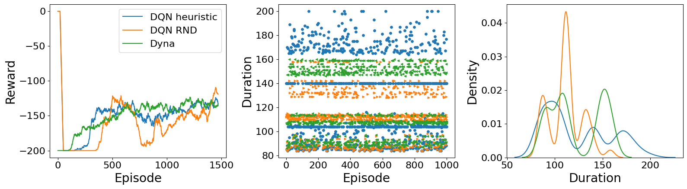

# Reinforcement Learning with Custom Agents

This repo contains implementations and analysis for reinforcement learning agents, including Random Agents, Deep Q-Networks (DQN), and Dyna agents. The primary objective is to explore and compare the performance of various reinforcement learning methods on the `MountainCar-v0` environment.

### Overview

The repository includes:
- Implementation of agents (`RandomAgent`, `DQNAgent`, and `DynaAgent`).
- Custom reward functions and auxiliary reward mechanisms for DQN.
- Replay buffers and MLP (Multi-Layer Perceptron) for training the agents.
- Tools for running experiments and analyzing results.
- Visualization scripts to compare agent performance.

### Features

1. **Agents**:
   - **RandomAgent**: Performs random actions without learning.
   - **DQNAgent**: Implements DQN with auxiliary reward mechanisms.
   - **DynaAgent**: Uses a model-based approach to reinforcement learning.

2. **Analysis and Visualization**:
   - Performance plots for rewards, losses, success rates, and duration.
   - Visualization of state visit counts and Q-value matrices.
   - Analysis of characteristic trajectories.

3. **Environment**:
   - The agents interact with the `MountainCar-v0` environment from `gymnasium`.

### Repository Structure

```
├── code
    ├── agents.py               # Implementation of RL agents
    ├── analyse.py              # Visualization and result analysis tools
    ├── main.py                 # Main script for training and evaluating agents
    ├── utility.py              # Supporting classes like ReplayBuffer and MLP
    ├── results_submission.ipynb # Notebook for analyzing results interactively
    ├── comparison.png          # Example output of performance comparison
├── configs
    ├── {config_files}.yml      # Configuration files (to keep easy reference)
    ...
├── runs
    ├── {agent_name}/           # Folder for results associated to given agent
        ├── {param_values}/
            ├── figs/
                ├── {figures}.png
                ...
            ├── config.yml      # Configuration associated to the given run 
            ├── metrics.h5      # Data associated to the run
            ├── trained_model.pt  # Weighs for trained model
        ...
    ...
├── report 
    # Files associated to the report 
```


### Getting Started

#### Prerequisites

Install dependencies using:
```bash
pip install -r requirements.yml
```
or the associated conda command 
```bash
conda env create --name env_name -f requirements.yml
```

#### Running the Code

1. **Training Agents**:
   Configure the `config.yml` file associated to your experiment and run:
   ```bash
   python main.py --config config.yml --colab False
   ```

2. **Performance Comparison**:
   Compare the performance of agents:
   ```bash
   python main.py --config {whatever_file}.yml --compare True
   ```

3. **Visualizing Results**:
   Results and plots are saved in the `runs/` directory. Example plots include reward trajectories, success rates, and Q-value matrices.

#### Example Configuration

Below is an example of a `config.yml` file:

```yaml
General : 
  agent_type : dqn_heuristic
  n_episodes : 3000

Files :
  runs_dir : ../runs

DQN : 
  Qs_NN_update_period : 3

Heuristic :
  degree : 2
  reward_scale : 0.7
```

### Results and Plots

The repository provides detailed plots for:
- Rewards per episode.
- Durations and success rates.
- Density estimates of agent durations.

Example output plot (`comparison.png`):



### Contributing

Contributions are welcome! If you want to add features or fix bugs, please fork the repository and open a pull request.
